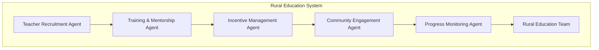

# Rural Education Empowerment Platform

An AI-powered platform that empowers educated rural youth—especially women—to become part-time teachers in their villages through non-monetary incentives like farming tools, food supplies, or scholarships.
# Agents urls 
Pipeline  : https://platform.aixplain.com/discover/agent/67e50f9fd6a777f40306b191?team=26927
1. Rural Education Team : https://platform.aixplain.com/discover/agent/67dfca08338999cb9696a566?team=26927
2. Progress Monitoring Agent : https://platform.aixplain.com/discover/agent/67dfc9f8338999cb9696a565?team=26927
3. Community Engagement Agent : https://platform.aixplain.com/discover/agent/67dfb3fe338999cb9696a526?team=26927
4. Incentive Management Agent : https://platform.aixplain.com/discover/agent/67dfb3fd181c58b7238eb907?team=26927
5. Training and Mentorship Agent : https://platform.aixplain.com/discover/agent/67dfb3fc338999cb9696a525?team=26927
6. Teacher Recruitment Agent : https://platform.aixplain.com/discover/agent/67dfb30a181c58b7238eb902?team=26927


## Pipeline Diagram


## Table of Contents
- [Overview](#overview)
- [System Architecture](#system-architecture)
- [Getting Started in Google Colab](#getting-started-in-google-colab)
- [Part 1: Setup and Create Agents](#part-1-setup-and-create-agents)
- [Part 2: Pipeline Creation](#part-2-pipeline-creation)
- [Part 3: Using the Interface](#part-3-using-the-interface)
- [Sample Data Structure](#sample-data-structure)
- [Testing Your Agents](#testing-your-agents)
- [Troubleshooting](#troubleshooting)


  ---

## Overview

This platform leverages AI agents to manage various aspects of a rural education program:

1. **Teacher Recruitment**: Identifies suitable local teachers
2. **Training & Mentorship**: Provides educational resources
3. **Incentive Management**: Manages non-monetary benefits
4. **Community Engagement**: Facilitates stakeholder communication
5. **Progress Monitoring**: Tracks educational outcomes

Together, these agents create a comprehensive system to establish and maintain sustainable education programs in rural communities.

## System Architecture

The system consists of five specialized agents coordinated by a team agent:

- **Teacher Recruitment Agent**: Identifies and recruits educated rural youth to become part-time teachers
- **Training & Mentorship Agent**: Provides educational resources and ongoing mentorship
- **Incentive Management Agent**: Tracks teacher participation and manages non-monetary incentives
- **Community Engagement Agent**: Facilitates communication between teachers, parents, and village elders
- **Progress Monitoring Agent**: Tracks student attendance, learning outcomes, and program growth
- **Rural Education Team**: Coordinates the activities of all specialized agents

Each agent is powered by a large language model (OpenAI GPT-4) via the aiXplain platform and has access to specific datasets to perform its role effectively.

## Getting Started in Google Colab

### Prerequisites
- Google Colab account
- aiXplain API key
- Sample CSV files (provided in the SampleData folder)

### Setting Up Your Environment

1. Create a new Google Colab notebook
2. Upload your sample data files to the Colab session
3. Set your aiXplain API key in the notebook

> **Note**: There is a ready-to-use execution file available in the Colab/Main directory that contains all the necessary code for this project.

## Part 1: Setup and Create Agents

Copy and paste the following code into your Colab notebook:

```python
# Install required packages
!pip install aixplain pandas requests

# Set up environment
import os
import pandas as pd
from aixplain.factories import AgentFactory, TeamAgentFactory
from aixplain.modules.agent.tool.model_tool import ModelTool
from google.colab import files

# Set your aixplain API key
os.environ["AIXPLAIN_API_KEY"] = "your_api_key_here"  # Replace with your actual API key

# Upload data files
print("Please upload your CSV files (teacher_data.csv, training_data.csv, incentives_data.csv, community_data.csv, student_data.csv)")
uploaded = files.upload()  # This will prompt you to upload files

# Reading the uploaded CSV files
file_names = list(uploaded.keys())
data_frames = {}

for file_name in file_names:
    # Skip non-CSV files if any
    if not file_name.endswith('.csv'):
        continue
    data_frames[file_name.replace('.csv', '')] = pd.read_csv(file_name)

print("Setup complete!")

# Create agent tools
speech_synthesis_tool = ModelTool(
    model="6171efa6159531495cadefc2",  # aiXplain - Text to Speech
    description="Converts text to speech for creating audio learning materials"
)

translation_tool = ModelTool(
    model="61b097551efecf30109d32da",  # aiXplain - Translation (OPUS-MT)
    description="Translates content between languages to support multilingual education"
)

# Create Individual Agents
teacher_recruitment_agent = AgentFactory.create(
    name="Teacher Recruitment Agent",
    description="""You are an agent that helps identify and recruit educated rural youth
    to become part-time teachers in their villages. You prioritize women candidates when
    appropriate and match candidates with teaching opportunities based on their skills,
    education level, and village proximity. You explain the non-monetary incentive system
    (farming tools, food supplies, scholarships) to candidates. 
    
    Here's the teacher data you have access to:
    """ + pd.DataFrame(data_frames.get('teacher_data', pd.DataFrame())).to_string() + """
    
    Here's the community data you have access to:
    """ + pd.DataFrame(data_frames.get('community_data', pd.DataFrame())).to_string(),
    llm_id="6646261c6eb563165658bbb1"  # aiXplain - OpenAI GPT-4
)

training_mentorship_agent = AgentFactory.create(
    name="Training and Mentorship Agent",
    description="""You are an agent that provides educational resources, training materials,
    and ongoing mentorship to rural part-time teachers. You help simplify complex educational
    concepts, suggest interactive teaching methods for rural settings with limited resources,
    and provide guidance on engaging students effectively. You particularly focus on strategies
    to promote girls' education and create inclusive learning environments.
    
    Here's the training data you have access to:
    """ + pd.DataFrame(data_frames.get('training_data', pd.DataFrame())).to_string() + """
    
    Basic mathematics teaching methods for rural settings: Focus on using everyday objects for counting, 
    measuring, and basic arithmetic. Use local contexts like farming calculations, market transactions, 
    and household budgeting to make concepts relevant.
    
    Language teaching in multilingual rural contexts: Start with familiar local language, 
    use storytelling from local traditions, gradually introduce national language, 
    use practical applications like letter writing and form filling.
    
    Science teaching with minimal resources: Use nature as laboratory, observe local plants and animals, 
    study agricultural practices, discuss weather patterns and seasonal changes, 
    use simple household items for experiments.
    
    Effective teaching methods for mixed-age classrooms: Group activities by ability rather than age, 
    use peer teaching where older students help younger ones, rotate attention between groups, 
    use self-directed activities, incorporate games and interactive learning.""",
    tools=[speech_synthesis_tool],
    llm_id="6646261c6eb563165658bbb1"  # aiXplain - OpenAI GPT-4
)

incentive_management_agent = AgentFactory.create(
    name="Incentive Management Agent",
    description="""You are an agent that tracks teacher participation and manages the 
    non-monetary incentives program. You help match teachers with appropriate incentives 
    such as farming tools, ration kits, school supplies, or scholarships based on their 
    needs and teaching contributions. You ensure fair distribution of resources and maintain
    records of allocated incentives.
    
    Here's the incentives data you have access to:
    """ + pd.DataFrame(data_frames.get('incentives_data', pd.DataFrame())).to_string() + """
    
    Here's the teacher data you have access to:
    """ + pd.DataFrame(data_frames.get('teacher_data', pd.DataFrame())).to_string(),
    llm_id="6646261c6eb563165658bbb1"  # aiXplain - OpenAI GPT-4
)

community_engagement_agent = AgentFactory.create(
    name="Community Engagement Agent",
    description="""You are an agent that facilitates communication between teachers, parents, 
    and village elders. You help organize community meetings, gather feedback from parents, 
    and ensure education is valued as a shared responsibility. You promote parental involvement
    in children's education and help address community concerns about education, especially
    for girls.
    
    Here's the community data you have access to:
    """ + pd.DataFrame(data_frames.get('community_data', pd.DataFrame())).to_string(),
    tools=[translation_tool, speech_synthesis_tool],
    llm_id="6646261c6eb563165658bbb1"  # aiXplain - OpenAI GPT-4
)

progress_monitoring_agent = AgentFactory.create(
    name="Progress Monitoring Agent",
    description="""You are an agent that tracks student attendance, learning outcomes, 
    and program growth. You analyze data to identify trends, success stories, and areas 
    needing improvement. You create progress reports for stakeholders and suggest 
    interventions for students or villages showing concerning patterns.
    
    Here's the student data you have access to:
    """ + pd.DataFrame(data_frames.get('student_data', pd.DataFrame())).to_string() + """
    
    Here's the teacher data you have access to:
    """ + pd.DataFrame(data_frames.get('teacher_data', pd.DataFrame())).to_string() + """
    
    Here's the community data you have access to:
    """ + pd.DataFrame(data_frames.get('community_data', pd.DataFrame())).to_string(),
    llm_id="6646261c6eb56316565*****"  # aiXplain - OpenAI GPT-4
)

# Create Team Agent
rural_education_team = TeamAgentFactory.create(
    name="Rural Education Team",
    description="""You are a team that empowers educated rural youth—especially women—to 
    become part-time teachers in their villages. You coordinate the recruitment, training, 
    incentive management, community engagement, and progress monitoring aspects of the 
    rural education program. You focus on creating sustainable education cycles within 
    communities through non-monetary incentive systems.""",
    agents=[
        teacher_recruitment_agent,
        training_mentorship_agent,
        incentive_management_agent,
        community_engagement_agent,
        progress_monitoring_agent
    ],
    llm_id="6646261c6eb56316565*****"  # aiXplain - OpenAI GPT-4
)

# Deploy Agents
print("\nDeploying all agents...")
agent_ids = {
    "teacher_recruitment": teacher_recruitment_agent.deploy(),
    "training_mentorship": training_mentorship_agent.deploy(),
    "incentive_management": incentive_management_agent.deploy(),
    "community_engagement": community_engagement_agent.deploy(),
    "progress_monitoring": progress_monitoring_agent.deploy(),
    "team": rural_education_team.deploy()
}

print("\nDeployment complete! Here are your agent IDs:")
for agent_name, agent_id in agent_ids.items():
    print(f"{agent_name}: {agent_id}")

# Save these IDs for future use!
```

After running this code block, your agents will be created and deployed. **Save the agent IDs** that are printed at the end, as you'll need them for the next step.

## Part 2: Pipeline Creation

In a new code cell, paste the following code to set up your pipeline:

```python
# Import required modules
from aixplain.modules.agent import Agent
from aixplain.factories import AgentFactory

# Agent IDs from your deployment - replace with your actual IDs
AGENT_IDS = {
    "teacher_recruitment": "YOUR_RECRUITMENT_AGENT_ID",
    "training_mentorship": "YOUR_TRAINING_AGENT_ID",
    "incentive_management": "YOUR_INCENTIVE_AGENT_ID",
    "community_engagement": "YOUR_COMMUNITY_AGENT_ID",
    "progress_monitoring": "YOUR_PROGRESS_AGENT_ID",
    "team": "YOUR_TEAM_AGENT_ID"
}

# Print out the agent IDs for reference
print("Agent IDs for reference:")
for agent_name, agent_id in AGENT_IDS.items():
    print(f"{agent_name}: {agent_id}")

# Function to send requests to agents
def direct_agent_request(query, action_type, village_id=None, teacher_id=None):
    """Send requests directly to agents"""
    # If you're in the same session as Part 1, you can use the agent objects directly
    if 'teacher_recruitment_agent' in globals():
        agent_map = {
            "recruitment": teacher_recruitment_agent,
            "training": training_mentorship_agent,
            "incentives": incentive_management_agent,
            "community": community_engagement_agent,
            "progress": progress_monitoring_agent,
            "full_cycle": rural_education_team
        }
        
        agent = agent_map.get(action_type)
        if not agent:
            return {"error": f"Unknown action type: {action_type}"}
        
        # Build the prompt
        prompt = query
        if village_id:
            prompt += f" (for village {village_id})"
        if teacher_id:
            prompt += f" (regarding teacher {teacher_id})"
            
        # Run the agent
        return agent.run(prompt)
    
    # If you're in a new session, use the API with agent IDs
    else:
        import requests
        import os
        
        # Get the API key from environment
        api_key = os.environ.get("AIXPLAIN_API_KEY", "")
        if not api_key:
            return {"error": "AIXPLAIN_API_KEY not set in environment"}
        
        # Map action types to agent IDs
        agent_id = AGENT_IDS.get(action_type)
        if not agent_id:
            return {"error": f"Unknown action type: {action_type}"}
        
        # Build the prompt
        prompt = query
        if village_id:
            prompt += f" (for village {village_id})"
        if teacher_id:
            prompt += f" (regarding teacher {teacher_id})"
        
        # Make API request
        url = f"https://api.aixplain.com/agents/{agent_id}/run"
        headers = {
            "Authorization": f"Bearer {api_key}",
            "Content-Type": "application/json"
        }
        data = {
            "prompt": prompt
        }
        
        try:
            response = requests.post(url, json=data, headers=headers)
            response.raise_for_status()
            return response.json()
        except Exception as e:
            return {"error": f"API request failed: {str(e)}"}

# Test with a sample query
print("\nTesting with a sample query:")
try:
    result = direct_agent_request(
        query="Find qualified female teachers for mathematics education",
        action_type="recruitment",
        village_id="V001"
    )
    print(result)
except Exception as e:
    print(f"Error in test query: {e}")
```

## Part 3: Using the Interface

Now add the interactive interface to your notebook by adding this code in a new cell:

```python
# Create a simple interface to interact with our agents
def run_coordinator_interface():
    """Simple command-line interface for program coordinators"""
    print("\n==== Rural Education Program Coordinator Interface ====\n")
    print("Available actions:")
    print("1. recruitment - Find and recruit teachers")
    print("2. training - Get training resources and guidance")
    print("3. incentives - Manage teacher incentives")
    print("4. community - Community engagement strategies")
    print("5. progress - Monitor student and program progress")
    print("6. full_cycle - Complete implementation plan")
    print("7. exit - Exit the interface")
    
    action_types = {
        "1": "recruitment",
        "2": "training",
        "3": "incentives",
        "4": "community",
        "5": "progress",
        "6": "full_cycle"
    }
    
    while True:
        action = input("\nSelect an action (1-7): ")
        
        if action == "7":
            print("Exiting coordinator interface")
            break
        
        if action not in ["1", "2", "3", "4", "5", "6"]:
            print("Invalid selection. Please choose 1-7.")
            continue
        
        query = input("Enter your question or request: ")
        
        village_id = None
        if input("Do you want to specify a village? (y/n): ").lower() == "y":
            village_id = input("Enter village ID (e.g., V001): ")
        
        teacher_id = None
        if action in ["2", "3"] and input("Do you want to specify a teacher? (y/n): ").lower() == "y":
            teacher_id = input("Enter teacher ID (e.g., T001): ")
        
        try:
            result = direct_agent_request(
                query=query,
                action_type=action_types[action],
                village_id=village_id,
                teacher_id=teacher_id
            )
            print("\nResponse:")
            print(result)
        except Exception as e:
            print(f"Error: {str(e)}")

# Run the interface
run_coordinator_interface()
```

## Sample Data Structure

The agents are trained with the following sample data (provided in the SampleData folder):

### teacher_data.csv
```
teacher_id,name,age,education_level,subjects,village_id,village_needs,suitability_score
T001,Sunita Mehta,22,Bachelor's,Math Science,V001,Primary Education,0.92
T002,Rajesh Kumar,25,Master's,English Social Studies,V002,Digital Literacy,0.85
T003,Priya Singh,24,Bachelor's,Science English,V003,Primary Education,0.78
T004,Amit Sharma,23,High School,Mathematics,V001,After-school Tutoring,0.65
T005,Geeta Patel,26,Master's,Computer Science,V004,Digital Literacy,0.90
```

### training_data.csv
```
training_id,module_name,duration_days,materials_required,schedule_date,village_id,status
TR001,Basic Pedagogy,3,Projector Handouts,2024-03-15,V001,Completed
TR002,Digital Tools,5,Laptops Internet,2024-04-01,V002,Planned
TR003,Inclusive Teaching,2,Handouts,2024-03-20,V003,Completed
TR004,Mathematics Methods,4,Calculators Manipulatives,2024-04-10,V001,Planned
TR005,Science Education,3,Lab Kits Posters,2024-04-15,V004,Planned
```

### incentives_data.csv
```
teacher_id,preferred_incentive,available_resources,allocated_incentive
T001,Scholarship,"Seeds, Books, Rations",Books
T002,Farming Tools,"Tools, Uniforms, Internet",Farming Tools
T003,Food Supplies,"Seeds, Rations, Internet",Rations
T004,School Supplies,"Books, Uniforms, Tools",Books
T005,Digital Resources,"Internet, Books, Tools",Internet Voucher
```

### community_data.csv
```
village_id,population,students_count,main_occupation,community_leader,contact_number,last_meeting_date
V001,1500,230,Farming,Sharma Ji,+91-9876543210,2024-02-15
V002,800,145,Handicrafts,Geeta Devi,+91-8765432109,2024-03-01
V003,1200,180,Fishing,Rajan Kumar,+91-7654321098,2024-02-20
V004,950,160,Weaving,Anjali Gupta,+91-6543210987,2024-03-10
V005,1100,175,Agriculture,Mohammed Khan,+91-5432109876,2024-02-25
```

### student_data.csv
```
student_id,name,village_id,attendance_percent,math_score,english_score,science_score
S001,Amit Sharma,V001,92,85,78,88
S002,Neha Gupta,V002,85,72,89,81
S003,Rahul Verma,V003,78,65,92,70
S004,Pooja Patel,V001,95,90,85,92
S005,Sanjay Kumar,V004,88,76,81,85
```

## Testing Your Agents

You can test your agents individually with pre-defined queries. Add the following code to a new cell:

```python
# Test Individual Agents
# If you're in a different session from Part 1, this will use the API method

def test_agents_with_scenarios():
    """Test agents with specific scenario questions"""
    test_scenarios = [
        {
            "agent": "recruitment",
            "query": "Find qualified female teachers for village V001 who can teach mathematics.",
            "village_id": "V001",
            "expected_output": "Contains teacher recommendations"
        },
        {
            "agent": "training",
            "query": "What teaching methods work best for mixed-age classrooms with limited resources?",
            "expected_output": "Contains teaching strategies"
        },
        {
            "agent": "incentives", 
            "query": "What incentives are available for teacher T004?",
            "teacher_id": "T004",
            "expected_output": "Contains incentive details"
        },
        {
            "agent": "community",
            "query": "How can we address resistance to girls' education in village V003?",
            "village_id": "V003",
            "expected_output": "Contains engagement strategies"
        },
        {
            "agent": "progress",
            "query": "Compare math performance between villages V001 and V002.",
            "expected_output": "Contains performance comparison"
        },
        {
            "agent": "full_cycle",
            "query": "Develop a plan to establish education in a new village with 150 students.",
            "expected_output": "Contains comprehensive plan"
        }
    ]
    
    results = {}
    
    for scenario in test_scenarios:
        print(f"\nTesting {scenario['agent']} agent:")
        print(f"Query: {scenario['query']}")
        
        try:
            response = direct_agent_request(
                query=scenario['query'],
                action_type=scenario['agent'],
                village_id=scenario.get('village_id'),
                teacher_id=scenario.get('teacher_id')
            )
            print(f"Response: {response}")
            
            # Store result
            results[scenario['agent']] = {
                "success": True,
                "response": response
            }
        except Exception as e:
            print(f"Error: {str(e)}")
            results[scenario['agent']] = {
                "success": False,
                "error": str(e)
            }
    
    # Print summary
    print("\n==== Test Results Summary ====")
    for agent, result in results.items():
        status = "✅ Passed" if result["success"] else "❌ Failed"
        print(f"{agent}: {status}")
    
    return results

# Run the tests
test_results = test_agents_with_scenarios()
```

## Troubleshooting

### Common Issues

#### API Key Issues
```
Error: AIXPLAIN_API_KEY not set in environment
```
**Solution**: Make sure to set your API key correctly:
```python
os.environ["AIXPLAIN_API_KEY"] = "your_api_key_here"
```

#### Import Errors
```
ImportError: cannot import name 'Step' from 'aixplain.modules.pipeline'
```
**Solution**: The aixplain package structure might have changed. Try updating the package:
```
!pip install --upgrade aixplain
```
If that doesn't work, use the direct agent approach with API calls shown in Part 2.

#### Agent Not Found
```
Error: Unknown action type: recruitment
```
**Solution**: Check that you're using the correct action type from: recruitment, training, incentives, community, progress, full_cycle.

#### API Errors
```
Error: API request failed: 404 Client Error
```
**Solution**: Verify that your agent IDs are correct and your API key has access to these agents. Double-check the AGENT_IDS dictionary in Part 2.

#### Session Expired
If your Colab session expires or is reset, you'll need to:
1. Re-run the setup code from Part 1
2. Update your agent IDs if you've created new agents
3. Re-run the pipeline and interface code

### Getting Additional Help

If you encounter issues not covered here:
1. Check the [aixplain documentation](https://docs.aixplain.com/)
2. Contact the aiXplain support team
3. Check for error messages in the Colab console output for specific API errors
